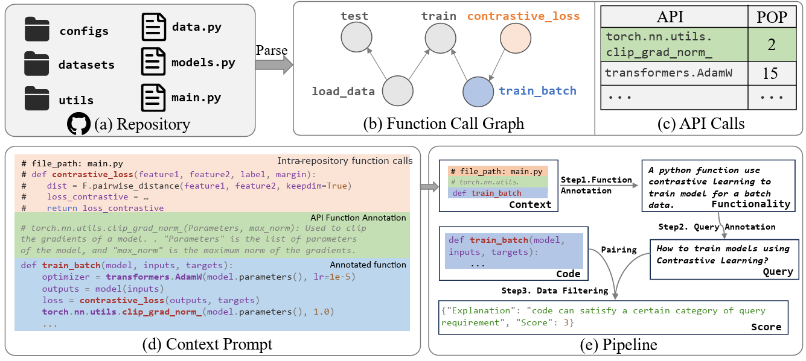

## Code Retrieval Dataset Construction via Understanding Repositories


### Framework



### Install Requirements
`pip3 install -r requirements.txt`

### Run Annotation
To run data annotation, you need to fill in the openai key and execute the following command:
```bash
cd annotation
python annotation.py
```

### Run Pretraining
We use the CodeSearchNet dataset to pre-train the CodeBERT model as an example:
```bash
lang=python
model=CodeBERT
mkdir -p ./saved_models_${model}_CSN/$lang
python main.py \
    --output_dir=./saved_models_${model}_CSN/$lang \
    --config_name=./${model} \
    --model_name_or_path=./${model} \
    --tokenizer_name=./${model} \
    --lang=$lang \
    --do_train \
    --use_amp \
    --train_data_file=dataset/$lang/train.jsonl \
    --eval_data_file=dataset/$lang/valid.jsonl \
    --test_data_file=dataset/$lang/test.jsonl \
    --codebase_file=dataset/$lang/codebase.jsonl \
    --num_train_epochs 10 \
    --code_length 256 \
    --data_flow_length 64 \
    --nl_length 128 \
    --train_batch_size 64 \
    --eval_batch_size 64 \
    --learning_rate 1e-5 \
    --seed 123456 2>&1| tee saved_models_${model}_CSN/$lang/train.log
```

### Run Fine-tuning
We use the CoNaLa dataset to finetune the pre-trained CodeBERT model as an example:
```bash
lang=python
model=CodeBERT
python main.py \
    --output_dir=./saved_models_${model}_CSN/$lang \
    --config_name=./${model} \
    --model_name_or_path=./${model} \
    --tokenizer_name=./${model} \
    --lang=$lang \
    --do_train \
    --do_finetune \
    --use_amp \
    --train_data_file=dataset/conala/train_pair.jsonl \
    --eval_data_file=dataset/conala/test_pair.jsonl \
    --test_data_file=dataset/conala/test_pair.jsonl \
    --codebase_file=dataset/conala/train_pair.jsonl \
    --num_train_epochs 10 \
    --code_length 256 \
    --data_flow_length 64 \
    --nl_length 128 \
    --train_batch_size 64 \
    --eval_batch_size 64 \
    --learning_rate 1e-5 \
    --seed 123456 2>&1| tee saved_models_${model}_CSN/$lang/train.log
```


### Evaluation
You only need to run `bash eval.sh` to evaluate model performance on all benchmarks. You can modify the corresponding models and pre-trained dataset settings in the eval.sh.


### Dataset
The dataset will be made available later.
